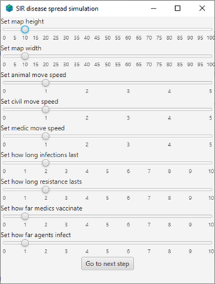
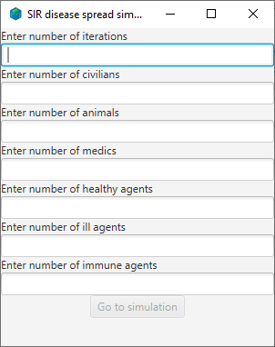

[![Contributors][contributors-shield]][contributors-url]
[![Issues][issues-shield]][issues-url]

<!-- TABLE OF CONTENTS -->

<details open="open">
  <summary><h2 style="display: inline-block">Table of Contents</h2></summary>
  <ol>
    <li>
      <a href="#about-the-project">About The Project</a>
      <ul>
        <li><a href="#description">Description</a></li>
      </ul>
      <ul>
        <li><a href="#legend">Legend</a></li>
      </ul>
      <ul>
        <li><a href="#built-with">Built With</a></li>
      </ul>
    </li>
    <li>
      <a href="#getting-started">Getting Started</a>
      <ul>
        <li><a href="#installation">Installation</a></li>
      </ul>
      <ul>
        <li><a href="#unit-tests">Unit Tests</a></li>
      </ul>
    </li>
    <li><a href="#usage">Usage</a></li>
    <li><a href="#contact">Contact</a></li>
  </ol>
</details>
<!-- ABOUT THE PROJECT -->

## About The Project


### Description

This application models a simple spread of disease and offers the ability to adjust starting parameters.

### Legend

Agents can be divided into **states** and **roles** which are represented graphically by the following symbols: 

##### Agent roles


##### Agent states


### Built With

* [Gradle 7](https://docs.gradle.org/7.0/release-notes.html)
* [Java FX 16](https://openjfx.io/javadoc/16/)
* [JUnit 5](https://junit.org/junit5/docs/current/user-guide/#overview-what-is-junit-5)
* [Google Guava 30](https://github.com/google/guava/releases/tag/v30.1)
* [JDK 15](https://openjdk.java.net/projects/jdk/15/)

<!-- GETTING STARTED -->

## Getting Started

To get a local copy up and running follow these simple steps.

### Installation

1. Clone the repo

   ```sh
   git clone https://github.com/OOP-project-pwr/ABM-app
   ```

2. Go to ABM-app directory and simply run gradle wrapper

   ```sh
   ./gradlew run
   ```

### Unit Tests

1. To run test **while** in ABM-app directory run

   ```sh
   ./gradlew clean test
   ```


<!-- USAGE EXAMPLES -->

## Usage

The simulation is initialized by two windows responsible for adjusting and setting the initial parameters, the first window:



Is responsible for setting the simulation parameters such: **field of view** for each agent, their **speed** or **map size**.

Second window is responsible for fetching user defined input for: **populations**, agent **states** and number of **iterations**.



Third and the last window is the simulation window that presents data of each step.

<!-- ROADMAP -->

## Roadmap

See the [open issues](https://github.com/OOP-project-pwr/ABM-app/issues) for a list of proposed features (and known issues).

<!-- CONTRIBUTING -->

## Contributing

Contributions are what make the open source community such an amazing place to be learn, inspire, and create. Any contributions you make are **greatly appreciated**.

1. Fork the Project
2. Create your Feature Branch (`git checkout -b feature/AmazingFeature`)
3. Commit your Changes (`git commit -m 'Add some AmazingFeature'`)
4. Push to the Branch (`git push origin feature/AmazingFeature`)
5. Open a Pull Request

<!-- CONTACT -->

## Contact

Project Link: [https://github.com/OOP-project-pwr/ABM-app](https://github.com/OOP-project-pwr/ABM-app)


<!-- MARKDOWN LINKS & IMAGES -->
<!-- https://www.markdownguide.org/basic-syntax/#reference-style-links -->

[contributors-shield]: https://img.shields.io/github/contributors/OOP-project-pwr/ABM-app?style=plastic
[contributors-url]: https://github.com/OOP-project-pwr/ABM-app/graphs/contributors
[issues-shield]: https://img.shields.io/github/issues/OOP-project-pwr/ABM-app?style=plastic
[issues-url]: https://github.com/OOP-project-pwr/ABM-app/issues